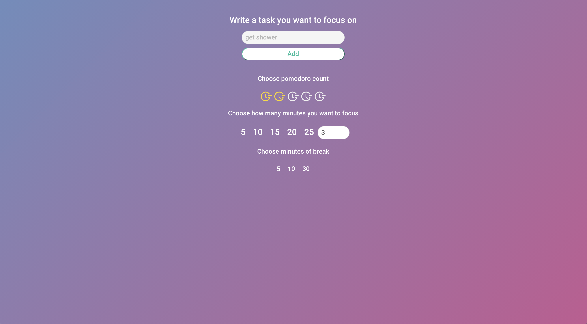

## If you familiar with [pomodoro](https://en.wikipedia.org/wiki/Pomodoro_Technique) technique, you can start use them. Since this technique is a great way to get organized.

* At the start you should set your task, choose pomodoro count, minutes, and break.

* After above steps, you can start doing your task.

## *Enjoy the beautiful design*
